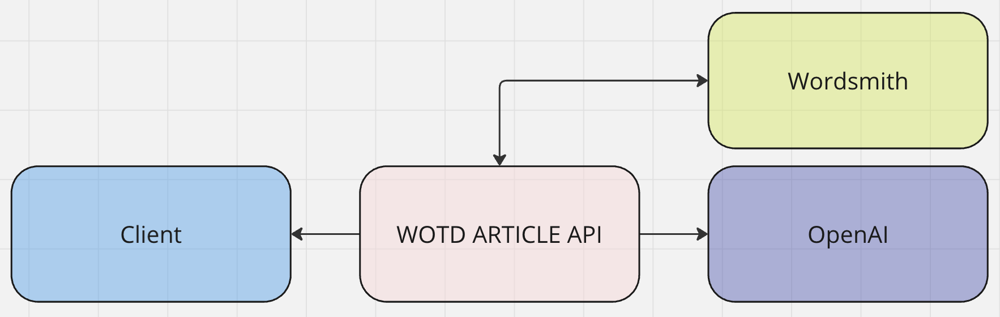

# Word of the Day Article App

This project is a Python application that retrieves and generates an article with the Word of the Day.

## Prerequisites

Before starting, please ensure you have the following installed:
- [Docker](https://www.docker.com/get-started)
- [Poetry](https://python-poetry.org/docs/#installation)

You will also need an [OpenAI API key](https://platform.openai.com/docs/quickstart).

## Local Run in Virtual Environment

1. **Create a local virtual environment:**

   ```bash
   python -m venv venv
   source venv/bin/activate  # On Windows use `venv\Scripts\activate`
   ```

2. **Install Poetry:**

   ```bash
   pip install poetry
   ```

3. **Install dependencies via Poetry:**

   ```bash
   poetry install
   ```

4. **Create a `.env` file:**

   Create a `.env` file in the root directory and set all environment variables according to the `settings` package. Example `.env` file:

   ```env
   OPENAI_API_KEY=your_openai_api_key
   API_PORT=8080
   ```

5. **Run the application:**

   If you use an IDE, you can create a configuration to execute `manage.py`, or you can run it manually:

   ```bash
   python manage.py
   ```

## Run in Docker

For execution in a Docker container:

1. **Create a `.env` file:**

   Create a `.env` file in the root directory and set all environment variables according to the `settings` package.

2. **Start the application using Docker:**

   ```bash
   make up
   ```

3. **Additional Makefile commands:**

   Use `make help` to get information about all available `Makefile` commands.

## Integration Diagram

Here you can see the diagram with the integration of the Word of the Day Article Application with third parties:


